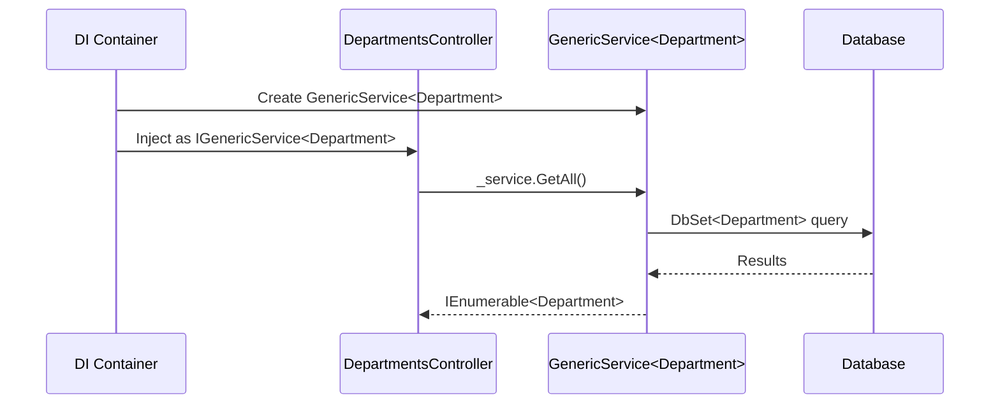

```mermaid
sequenceDiagram
    participant DI as DI Container
    participant C as DepartmentsController
    participant S as GenericService<Department>
    participant DB as Database

    DI->>S: Create GenericService<Department>;
    DI->>C: Inject as IGenericService<Department>
    C->>S: _service.GetAll()
    S->>DB: DbSet<Department> query
    DB-->>S: Results
    S-->>C: IEnumerable<Department>
```